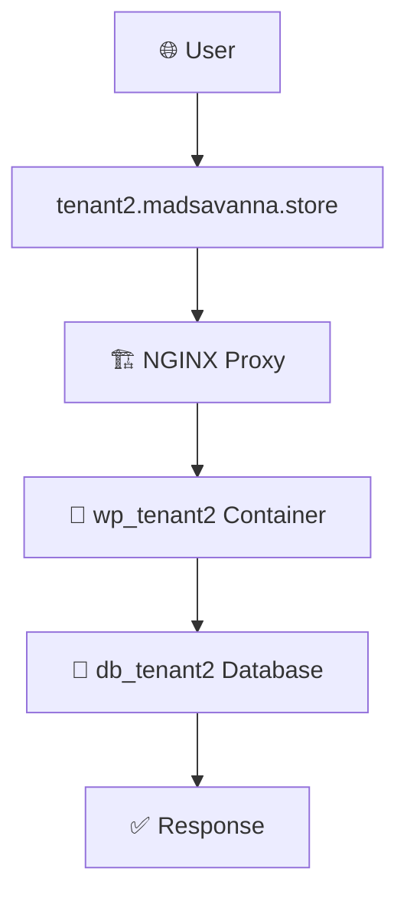
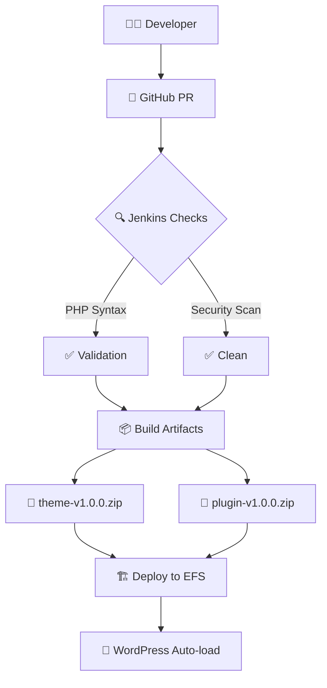

# 🏗️ WordPress SaaS Architecture (Docker Compose)

> **Current Implementation**: Non-Kubernetes, container-based multi-tenant WordPress platform

## 📊 System Architecture Diagram

```
                          🌐
                          │
                 ┌────────▼────────┐
                 │    Internet     │
                 └────────┬────────┘
                          │
             ┌────────────▼────────────┐
             │                         │
    tenant1.madsavanna.store    tenant2.madsavanna.store
             │                         │
             └────────────┬────────────┘
                          │
                 ┌────────▼────────┐
                 │   🏗️ NGINX Proxy   │
                 │ Reverse Proxy/LB  │
                 │                   │
                 │ Routes by Host    │
                 │ tenant1 → wp_t1   │
                 │ tenant2 → wp_t2   │
                 └────────┬─────────┘
                          │
            ┌─────────────┴─────────────┐
            │                           │
   ┌────────▼────────┐         ┌────────▼────────┐
   │ 🚀 WordPress    │         │ 🚀 WordPress    │
   │   Tenant 1      │         │   Tenant 2      │
   │ wp_tenant1      │         │ wp_tenant2      │
   │                 │         │                 │
   │ /var/www/html   │         │ /var/www/html   │
   │ wp-content→EFS  │         │ wp-content→EFS  │
   └────────┬────────┘         └────────┬────────┘
            │                           │
   ┌────────▼────────┐         ┌────────▼────────┐
   │ 🐬 MySQL        │         │ 🐬 MySQL        │
   │   Tenant 1      │         │   Tenant 2      │
   │ db_tenant1      │         │ db_tenant2      │
   │ (Isolated DB)   │         │ (Isolated DB)   │
   └─────────────────┘         └─────────────────┘
```

---

## 🔄 CI/CD Pipeline Layer

```
   ┌─────────────┐     ┌─────────────┐     ┌─────────────┐
   │  Developer  │────▶│   GitHub    │────▶│  Jenkins    │
   │             │     │   PR/Merge  │     │   Pipeline  │
   └─────────────┘     └─────────────┘     └──────┬──────┘
                                                   │
                                                   ▼
   ┌─────────────┐     ┌─────────────┐     ┌─────────────┐
   │ PHP Syntax  │────▶│ Build Art.  │────▶│ Store for   │
   │ Validation  │     │ theme.zip   │     │ Rollback    │
   │ Security    │     │ plugin.zip  │     └─────────────┘
   │ Checks      │     └─────────────┘
   └─────────────┘
```

```
   ┌─────────────────────────────┐
   │    📦 Shared Storage        │
   │  (EFS / Docker Volume)      │
   │                             │
   │  tenants/tenant1/wp-content │
   │  ├── themes/                │
   │  └── plugins/               │
   │                             │
   │  tenants/tenant2/wp-content │
   │  ├── themes/                │
   │  └── plugins/               │
   └─────────────────────────────┘
```

---

## 📈 Observability Layer

```
   ┌─────────────┐     ┌─────────────┐
   │ 📊 Metrics  │◀────│ 🔌 Exporters │
   │ Prometheus  │     │             │
   │ Port: 9090  │     │ • NGINX     │
   └──────┬──────┘     │ • MySQL     │
          │            │ • cAdvisor  │
          ▼            └─────────────┘
   ┌─────────────┐
   │ 📊 Grafana   │
   │ Dashboards   │
   │ Port: 3000   │
   └─────────────┘
```

---

## 🔄 How It Works: Request Flow

### 📥 Tenant 1 Request Flow


### 📥 Tenant 2 Request Flow


---

## 🚀 CI/CD Flow



---

## 🛡️ Security Principles

| 🔒 Security Layer | 🛡️ Implementation |
|-------------------|-------------------|
| **Tenant Isolation** | Separate DB + volumes per tenant |
| **Code Security** | CI blocks dangerous functions |
| **Secrets Management** | env files, not in Git |
| **Access Control** | Per-tenant containers |
| **Rollback Security** | Versioned artifacts |

---

## 📋 SaaS-Grade Features Matrix

| 🎯 SaaS Requirement | ✅ Your Implementation |
|---------------------|------------------------|
| **Multi-tenancy** | ✅ One platform, many tenants |
| **Data Isolation** | ✅ Per-tenant databases |
| **File Isolation** | ✅ Per-tenant volumes |
| **Scalability** | ✅ Add containers easily |
| **CI/CD** | ✅ Versioned deployments |
| **Rollback** | ✅ Jenkins artifact storage |
| **Security** | ✅ PR gates + isolation |
| **Monitoring** | ✅ Prometheus + Grafana |
| **Zero-downtime** | ✅ No container rebuilds needed |

---

## 🎨 Key Design Decisions

### ✅ **Why This Architecture Works**

1. **🚫 No Cross-Tenant Contamination**
   - Each tenant = separate DB + volume
   - NGINX routes by domain
   - Container isolation

2. **🔄 Zero-Downtime Deployments**
   - Theme/plugin updates don't require container restarts
   - Shared volumes auto-mount changes
   - Jenkins stores rollback versions

3. **📊 Built-in Observability**
   - Prometheus scrapes all components
   - Grafana provides dashboards
   - cAdvisor monitors containers

4. **🔒 Security-First Design**
   - Secrets not in Git
   - CI validates all code
   - Per-tenant isolation

---

## 🎯 Real-World Benefits

- **🏢 Enterprise-Ready**: Multi-tenant isolation
- **🚀 DevOps-Friendly**: Automated CI/CD
- **👁️ Observable**: Full monitoring stack
- **🔧 Maintainable**: Docker Compose simplicity
- **📈 Scalable**: Add tenants without redeployment
