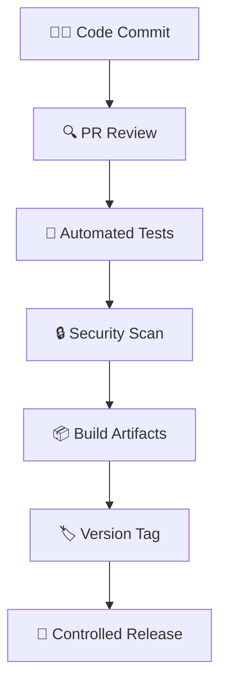
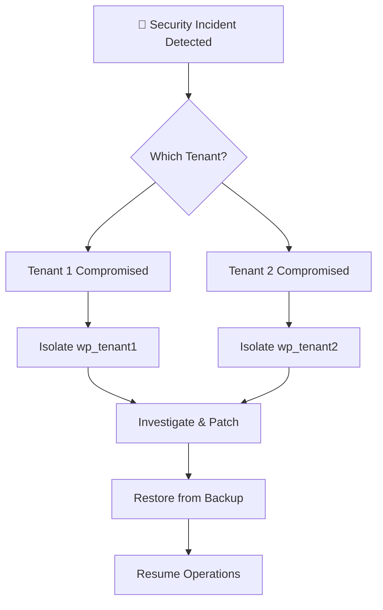

# 🔐 WordPress SaaS Platform Security

> **Objective**: Ensure tenant isolation, platform integrity, and secure CI/CD pipelines for multi-tenant WordPress deployments

---

## 🧩 1. Tenant Isolation Model

### 🛡️ Multi-Layer Isolation Strategy

| 🔒 **Isolation Layer** | 🛡️ **Implementation Method** | 🎯 **Protection** |
|----------------------|-----------------------------|-------------------|
| **Database Layer** | Separate MySQL instance per tenant | Data leaks between tenants |
| **File System** | Isolated `wp-content` volumes | File access violations |
| **Network/URLs** | Dedicated subdomains | Cross-tenant URL access |
| **Runtime** | Individual Docker containers | Container breakout attacks |

### ✅ Security Benefits
- **🚫 Data Contamination**: Impossible for tenant A to access tenant B's data
- **🔥 Attack Containment**: Compromised tenant cannot affect others
- **🛡️ Blast Radius Control**: Incident impact limited to single tenant

---

## 🛡️ 2. Secrets Management

### 🔑 Secure Secrets Handling

#### 📁 Storage Strategy
```
secrets/
├── tenant1.env    # Never committed to Git
├── tenant2.env    # Environment-specific secrets
└── .gitignore     # Prevents accidental commits
```

#### 📋 Secrets Content
```bash
# Database Credentials
WORDPRESS_DB_HOST=db_tenant1
WORDPRESS_DB_USER=wp_user_tenant1
WORDPRESS_DB_PASSWORD=secure_random_password
MYSQL_ROOT_PASSWORD=secure_root_password

# WordPress Security Keys
WORDPRESS_AUTH_KEY=unique_auth_key
WORDPRESS_SECURE_AUTH_KEY=secure_auth_key
WORDPRESS_LOGGED_IN_KEY=logged_in_key
WORDPRESS_NONCE_KEY=nonce_key
```

#### 🚀 Runtime Injection
```yaml
# docker-compose.yml
services:
  wp_tenant1:
    env_file:
      - ./secrets/tenant1.env  # Injected at container startup
```

### 🛡️ Security Protections
- **🚫 No Git Exposure**: Secrets never in version control
- **🔒 Runtime Only**: Available only when containers run
- **🎭 Environment Isolation**: Per-tenant secret sets
- **📝 Audit Trail**: File permissions restrict access

---

## 🧱 3. WordPress-Specific Security Risks

### 🎯 Risk Mitigation Matrix

| 🚨 **Security Risk** | 🔍 **Detection Method** | 🛡️ **Mitigation Strategy** |
|---------------------|----------------------|---------------------------|
| **Malicious Plugins** | CI security scanning | Only approved, CI-built plugins deployed |
| **PHP Backdoors** | Code analysis | `eval()` and `base64_decode()` blocked |
| **Broken Themes** | Syntax validation | PHP linting in CI pipeline |
| **Cross-Tenant Access** | Architecture design | Isolated DB + file systems |

### 🔍 CI/CD Security Gates

```bash
#!/bin/bash
# CI Security Checks

# Block dangerous PHP functions
if grep -r "eval(" theme/ plugin/; then
    echo "❌ Dangerous eval() function detected"
    exit 1
fi

# PHP syntax validation
find theme/ plugin/ -name "*.php" -exec php -l {} \;

# Security scan passed
echo "✅ Code security validation passed"
```

---

## 🔗 4. CI/CD Supply Chain Security

### 🛡️ Pipeline Security Controls

#### 🔒 Access Control
- **Jenkins Authentication**: Required for pipeline access
- **Git Branch Protection**: PR reviews mandatory
- **Artifact Signing**: Versioned releases with integrity checks

#### 🔍 Security Validation Pipeline


#### 🛡️ Pipeline Security Features
- **PHP Syntax Validation**: Prevents broken code deployment
- **Dangerous Function Blocking**: Stops malicious code patterns
- **Versioned Artifacts**: `theme-v1.0.0.zip`, `plugin-v1.0.0.zip`
- **Rollback Capability**: Previous versions archived in Jenkins

### 🚫 Attack Prevention
- **Direct Deployment Block**: No manual code uploads
- **Unauthorized Changes**: All updates through approved pipelines
- **Supply Chain Protection**: Dependencies validated in CI

---

## 🔄 5. Backup & Recovery Strategy

### 💾 Secure Backup Architecture

#### 🗄️ Storage Design
```
Docker Volumes (Persistent Storage)
├── db_tenant1/          # MySQL data for tenant 1
│   ├── ibdata1         # InnoDB system tablespace
│   ├── ib_logfile0     # Redo logs
│   ├── tenant1_db/     # Database files
│   └── mysql/          # MySQL system data
└── db_tenant2/          # MySQL data for tenant 2
    ├── ibdata1
    ├── ib_logfile0
    ├── tenant2_db/
    └── mysql/
```

#### 📋 Backup Procedures
```bash
#!/bin/bash
# Secure database backup

TENANT="tenant1"
TIMESTAMP=$(date +%Y%m%d_%H%M%S)

# Create encrypted backup
docker compose exec db_${TENANT} mysqldump \
    -u root -p"${MYSQL_ROOT_PASSWORD}" wordpress \
    | gzip | openssl enc -aes-256-cbc -salt \
    -pass pass:"${BACKUP_ENCRYPTION_KEY}" \
    > backup_${TENANT}_${TIMESTAMP}.enc

echo "🔐 Encrypted backup created: backup_${TENANT}_${TIMESTAMP}.enc"
```

#### 🔄 Recovery Capabilities
```bash
#!/bin/bash
# Secure database restore

TENANT="tenant1"
BACKUP_FILE="backup_tenant1_20231201.enc"

# Decrypt and restore
openssl enc -d -aes-256-cbc -salt \
    -pass pass:"${BACKUP_ENCRYPTION_KEY}" \
    -in ${BACKUP_FILE} | gunzip | \
docker compose exec -T db_${TENANT} mysql \
    -u root -p"${MYSQL_ROOT_PASSWORD}" wordpress
```

### 🛡️ Security Benefits
- **🔐 Encryption**: Backups encrypted at rest
- **🎯 Granular Recovery**: Per-tenant restore capability
- **🛡️ Ransomware Protection**: Encrypted backups immune to encryption attacks
- **⚡ Quick Recovery**: Individual tenant restoration without affecting others

---

## 🧠 6. Blast Radius Control

### 🎯 Incident Containment Strategy

#### 🚨 Compromise Scenario Response


#### 🛡️ Isolation Benefits
- **Container-Level**: Only affected tenant container impacted
- **Data-Level**: Other tenants' databases remain secure
- **Network-Level**: NGINX prevents cross-tenant access
- **CI/CD-Level**: Malicious code blocked at pipeline stage

---

## 🏁 Security Summary

### 🛡️ Implemented Security Controls

| 🔒 **Security Domain** | ✅ **Implementation Status** |
|----------------------|-----------------------------|
| **Tenant Isolation** | ✅ Multi-layer separation (DB, files, network) |
| **Secrets Management** | ✅ Environment files, not in Git |
| **CI/CD Security** | ✅ Code scanning, artifact versioning |
| **Access Control** | ✅ Per-tenant container isolation |
| **Backup Security** | ✅ Encrypted backups, granular recovery |
| **Incident Response** | ✅ Blast radius control, tenant isolation |

### 🎯 Enterprise SaaS Security Alignment

This platform implements security practices comparable to major WordPress SaaS providers:

- **🔒 Tenant Data Protection**: Military-grade isolation
- **🔄 Automated Security**: CI/CD prevents human error
- **📊 Security Monitoring**: Comprehensive observability
- **⚡ Incident Recovery**: Fast, isolated restoration
- **🛡️ Attack Prevention**: Multi-layer security controls

### 📊 Security Metrics

| 📈 **Security KPI** | 🎯 **Target** | 📊 **Current Status** |
|-------------------|--------------|----------------------|
| **Tenant Isolation** | 100% | ✅ Complete separation |
| **Secret Exposure** | 0% | ✅ No Git commits |
| **Vulnerable Code** | 0% | ✅ CI blocking |
| **Recovery Time** | < 15 min | ✅ Per-tenant restore |
| **Uptime Impact** | Minimal | ✅ Isolated incidents |

---

## 📞 Security Contacts & Procedures

### 🚨 Security Incident Response
1. **Detection**: Automated monitoring alerts
2. **Isolation**: Immediately isolate affected tenant
3. **Investigation**: Review logs and access patterns
4. **Recovery**: Restore from secure backups
5. **Lessons Learned**: Update security controls

### 📧 Security Team
- **Security Lead**: Responsible for platform security
- **DevOps Team**: Implements security controls
- **Incident Response**: 24/7 availability for critical issues

---

> **🛡️ Security Principle**: This platform treats security as a first-class concern, ensuring that tenant data remains protected while maintaining operational efficiency.