# 👥 Tenant Onboarding Guide

> **WordPress SaaS Platform** - Add new tenants without platform redeployment

---

## 🎯 What Each Tenant Gets

| 🎁 **Resource** | 📋 **Description** | 🔒 **Isolation Level** |
|----------------|-------------------|----------------------|
| **🐬 Database** | Dedicated MySQL instance | Complete data isolation |
| **🚀 WordPress Site** | Full WordPress installation | Separate container |
| **📁 File Storage** | Isolated uploads/themes/plugins | Dedicated volume |
| **🌐 Subdomain** | Unique URL access | DNS-based routing |

---

## 🔄 High-Level Onboarding Flow

```mermaid
graph TD
    A[📝 Customer Signs Up] --> B[👤 Create Tenant Record]
    B --> C[🐬 Provision Database]
    C --> D[🚀 Setup WordPress Container]
    D --> E[🏗️ Configure NGINX Routing]
    E --> F[🌐 Add DNS Record]
    F --> G[✅ Tenant Goes Live]

    style A fill:#e1f5fe
    style G fill:#c8e6c9
```



---

## 🛠️ Step-by-Step Onboarding Process

### 📋 **Example: Onboarding "acme" Company**

---

### 1️⃣ 📁 **Create Tenant Directory Structure**

```bash
# Create isolated tenant directory
mkdir -p tenants/acme/wp-content/themes
mkdir -p tenants/acme/wp-content/plugins
mkdir -p tenants/acme/wp-content/uploads

# Set proper permissions
chmod -R 755 tenants/acme/
```

#### 🎯 **Why This Matters**
- **File Isolation**: Each tenant's uploads/themes/plugins are completely separate
- **Container Mounting**: `./tenants/acme/wp-content:/var/www/html/wp-content`
- **No Cross-Contamination**: Tenant A cannot access tenant B's files

---

### 2️⃣ 🐬 **Create Dedicated Database**

```sql
-- Connect to MySQL and run:
CREATE DATABASE acme_db;
CREATE USER 'acme_user'@'%' IDENTIFIED BY 'strong_password_here';
GRANT ALL PRIVILEGES ON acme_db.* TO 'acme_user'@'%';
FLUSH PRIVILEGES;
```

#### 🔒 **Security Benefits**
- **Complete Isolation**: `acme_user` can only access `acme_db`
- **No Data Leaks**: Impossible to query other tenant databases
- **Granular Access**: Full control over tenant's data

---

### 3️⃣ 🔐 **Create Secrets Configuration**

```bash
# Create secrets/acme.env
cat > secrets/acme.env << EOF
# Database Configuration
WORDPRESS_DB_HOST=db_acme
WORDPRESS_DB_NAME=acme_db
WORDPRESS_DB_USER=acme_user
WORDPRESS_DB_PASSWORD=strong_password_here

# WordPress Security Keys (Generate unique ones)
WORDPRESS_AUTH_KEY=unique_key_here
WORDPRESS_SECURE_AUTH_KEY=secure_key_here
WORDPRESS_LOGGED_IN_KEY=logged_in_key_here
WORDPRESS_NONCE_KEY=nonce_key_here
WORDPRESS_AUTH_SALT=auth_salt_here
WORDPRESS_SECURE_AUTH_SALT=secure_auth_salt_here
WORDPRESS_LOGGED_IN_SALT=logged_in_salt_here
WORDPRESS_NONCE_SALT=nonce_salt_here

# Optional: Pre-configure admin user
WORDPRESS_ADMIN_USER=admin
WORDPRESS_ADMIN_PASSWORD=secure_admin_password
WORDPRESS_ADMIN_EMAIL=admin@acme.company.com
EOF

# Secure the secrets file
chmod 600 secrets/acme.env
```

#### 🛡️ **Security Features**
- **Never in Git**: Secrets are environment-specific
- **Runtime Injection**: Only available when containers run
- **Unique Keys**: Each tenant has different WordPress salts

---

### 4️⃣ 🐳 **Add Tenant to Docker Compose**

```yaml
# Add to docker-compose.yml

services:
  # WordPress Container for ACME
  wp_acme:
    image: wordpress:php8.2
    env_file:
      - ./secrets/acme.env
    volumes:
      - ./tenants/acme/wp-content:/var/www/html/wp-content
    depends_on:
      - db_acme
    networks:
      - app_network

  # Database for ACME
  db_acme:
    image: mysql:8
    env_file:
      - ./secrets/acme.env
    volumes:
      - db_acme:/var/lib/mysql
    networks:
      - app_network

# Add volume definition
volumes:
  db_acme:
```

#### 🚀 **Container Benefits**
- **Isolation**: Separate container per tenant
- **Scaling**: Can add multiple instances if needed
- **Resource Control**: CPU/memory limits per tenant

---

### 5️⃣ 🏗️ **Configure NGINX Routing**

```nginx
# Add to nginx/tenants.conf

server {
    listen 80;
    server_name acme.company.com;

    location / {
        proxy_pass http://wp_acme;
        proxy_set_header Host $host;
        proxy_set_header X-Real-IP $remote_addr;
        proxy_set_header X-Forwarded-For $proxy_add_x_forwarded_for;
        proxy_set_header X-Forwarded-Proto $scheme;
    }

    # Optional: Add stub status for monitoring
    location /nginx-status {
        stub_status on;
        access_log off;
        allow 127.0.0.1;
        deny all;
    }
}
```

#### 🌐 **Routing Logic**
- **Domain-Based**: `acme.company.com` → `wp_acme` container
- **Header Forwarding**: Preserves original request information
- **Load Balancing**: Ready for multiple WordPress instances

---

### 6️⃣ 🌐 **Add DNS Configuration**

```bash
# Add to /etc/hosts for local testing
127.0.0.1 acme.company.com

# For production, add to DNS provider:
# acme.company.com → [Your Server IP]
```

#### 🔍 **DNS Resolution**
- **Local Development**: Hosts file entry
- **Production**: Point subdomain to server IP
- **CDN Ready**: Can add CloudFlare/CloudFront in front

---

### 7️⃣ 🚀 **Launch the Tenant**

```bash
# Start the new tenant
docker compose up -d wp_acme db_acme

# Reload NGINX configuration
docker compose exec nginx nginx -s reload

# Verify services are running
docker compose ps
```

#### ✅ **Verification Steps**
```bash
# Check container status
docker compose ps wp_acme db_acme

# Test website access
curl -I http://acme.company.com

# Check database connectivity
docker compose exec db_acme mysql -u acme_user -p acme_db -e "SELECT 1;"
```

---

## 🎉 **Tenant Goes Live!**

### 🌐 **Access Points**
- **Website**: `http://acme.company.com`
- **WordPress Admin**: `http://acme.company.com/wp-admin`
- **Database**: Isolated MySQL instance
- **File Storage**: Dedicated volume mounts

### 📊 **Monitoring Integration**

The new tenant is automatically monitored:

```yaml
# Prometheus scraping configuration
scrape_configs:
  - job_name: 'wordpress-acme'
    static_configs:
      - targets: ['wp_acme:80']

  - job_name: 'mysql-acme'
    static_configs:
      - targets: ['mysql-exporter-acme:9104']
```

---

## 🔧 **Tenant Management Scripts**

### 🚀 **Automated Onboarding Script**

```bash
#!/bin/bash
# onboard_tenant.sh

TENANT_NAME=$1
DOMAIN=$2

if [ -z "$TENANT_NAME" ] || [ -z "$DOMAIN" ]; then
    echo "Usage: $0 <tenant_name> <domain>"
    echo "Example: $0 acme acme.company.com"
    exit 1
fi

echo "🚀 Onboarding tenant: $TENANT_NAME ($DOMAIN)"

# 1. Create directory structure
echo "📁 Creating tenant directories..."
mkdir -p tenants/$TENANT_NAME/wp-content/{themes,plugins,uploads}

# 2. Generate secure password
DB_PASSWORD=$(openssl rand -base64 12)
ADMIN_PASSWORD=$(openssl rand -base64 12)

# 3. Create secrets file
echo "🔐 Creating secrets file..."
cat > secrets/$TENANT_NAME.env << EOF
WORDPRESS_DB_HOST=db_$TENANT_NAME
WORDPRESS_DB_NAME=${TENANT_NAME}_db
WORDPRESS_DB_USER=${TENANT_NAME}_user
WORDPRESS_DB_PASSWORD=$DB_PASSWORD
MYSQL_ROOT_PASSWORD=root_secure_password
MYSQL_DATABASE=${TENANT_NAME}_db
MYSQL_USER=${TENANT_NAME}_user
MYSQL_PASSWORD=$DB_PASSWORD
WORDPRESS_ADMIN_USER=admin
WORDPRESS_ADMIN_PASSWORD=$ADMIN_PASSWORD
WORDPRESS_ADMIN_EMAIL=admin@$DOMAIN
EOF

echo "✅ Tenant $TENANT_NAME onboarded successfully!"
echo "🌐 Access at: http://$DOMAIN"
echo "👤 Admin credentials in: secrets/$TENANT_NAME.env"
```

#### Usage
```bash
./onboard_tenant.sh acme acme.company.com
```

---

## 📊 **Scaling Considerations**

### ➕ **Adding More Resources to a Tenant**

```yaml
# For high-traffic tenants, add multiple WordPress instances
wp_acme_1:
  image: wordpress:php8.2
  # ... configuration

wp_acme_2:
  image: wordpress:php8.2
  # ... configuration

# Update NGINX for load balancing
upstream acme_backend {
    server wp_acme_1:80;
    server wp_acme_2:80;
}
```

---

## 🛡️ **Security Best Practices**

### 🔐 **Tenant Isolation Verification**
- ✅ Database: Separate MySQL instance
- ✅ Files: Isolated volume mounts
- ✅ Network: Container-level segregation
- ✅ Secrets: Per-tenant environment files

### 🚫 **What Tenants Cannot Do**
- Access other tenants' databases
- Read other tenants' files
- Affect other tenants' performance
- Bypass NGINX routing rules

---

## 📈 **Operational Metrics**

| 📊 **Metric** | 🎯 **Target** | ⏱️ **Time** |
|--------------|--------------|------------|
| **Onboarding Time** | < 10 minutes | Per tenant |
| **DNS Propagation** | < 5 minutes | Local testing |
| **First Access** | < 2 minutes | Container startup |
| **Isolation** | 100% | Always |

---

## 🎯 **Key Benefits**

- **⚡ Zero Platform Downtime**: Add tenants without restarting existing ones
- **🔒 Complete Isolation**: Each tenant is fully sandboxed
- **📈 Horizontal Scaling**: Add resources per tenant as needed
- **🔄 Automated Process**: Scripts can automate onboarding
- **🛡️ Security First**: Multi-layer isolation prevents breaches

---

> **💡 Pro Tip**: This onboarding process scales to hundreds of tenants while maintaining complete isolation and security.


